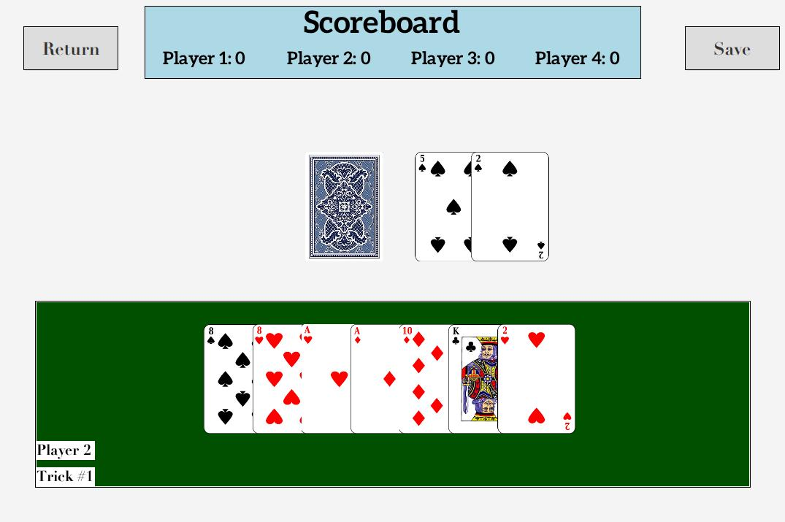

## Screenshot



## Features

| No  | Feature                                                                                                                               | Completed (Y/P/N) |
| --- | ------------------------------------------------------------------------------------------------------------------------------------- | ----------------- |
| 1   | All cards should be faced up to facilitate checking.                                                                                  | Y                 |
| 2   | Start a new game with randomized 52 cards.                                                                                            | Y                 |
| 3   | The first card in the deck is the first lead card and is placed at the center.                                                        | Y                 |
| 4   | The first lead card determines the first player.                                                                                      | Y                 |
| 5   | Deal 7 cards to each of the 4 players.                                                                                                | Y                 |
| 6   | All players must follow the suit or rank of the lead card.                                                                            | Y                 |
| 7   | The highest-rank card with the same suit as the lead card wins the trick.                                                             | Y                 |
| 8   | The winner of a trick leads the next card.                                                                                            | Y                 |
| 9   | If a player cannot follow suit or rank, the player must draw from the deck until a card can be played.                                | Y                 |
| 10  | When the remaining deck is exhausted and the player cannot play, the player does not play in the trick.                               | Y                 |
| 11  | Finish a round of game correctly. Display the score of each player.                                                                   | Y                 |
| 12  | Can exit and save the game (use file or database).                                                                                    | Y                 |
| 13  | Can resume the game. The state of the game is restored when resuming a game (use file or database).                                   | Y                 |
| 14  | Reset the game. All scores become zero. Round and trick number restart from 1.                                                        | Y                 |
| 15  | Support GUI playing mode (cards should be faced up or down as in the real game). The GUI can be in JavaFX, Swing, Spring, or Android. | Y                 |
| 16  | Keep the console output to facilitate checking. The data in console output and the GUI must tally.                                    | Y                 |

## User Guide

Watch [How to Play Go Boom](https://youtu.be/NmKOzmNs2Ms?si=YfLlGKBT9O8pA1y0) Youtube to understand the game.

## Compilation Instructions

How to run the code?

For cli version

```
javac *.java && java Main
```

For GUI version

```
javac *.java && java GUI
```
